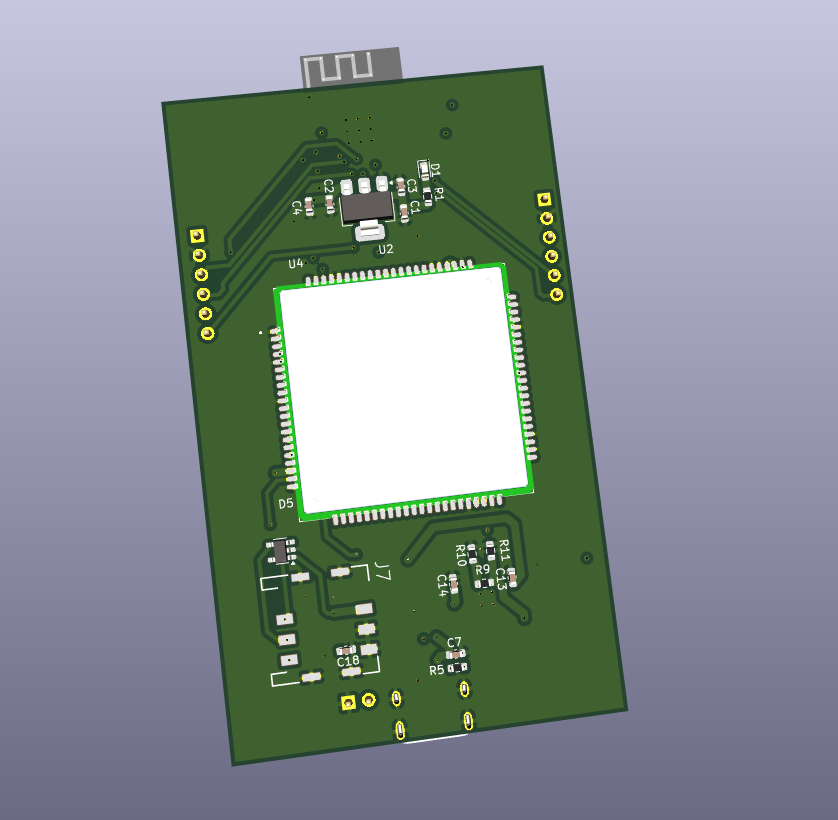
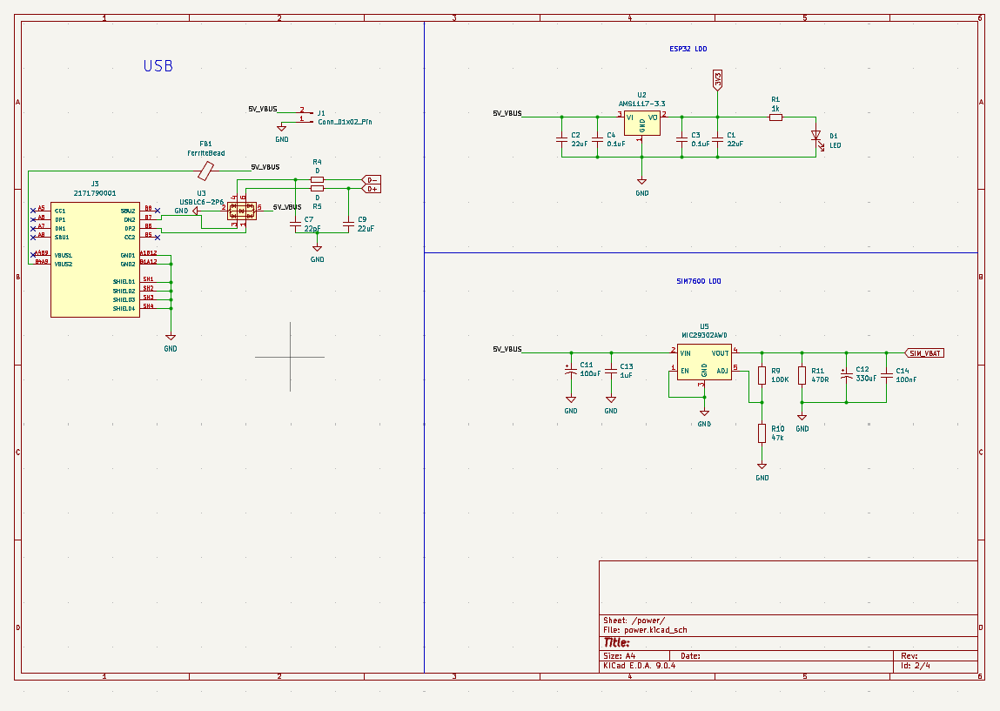
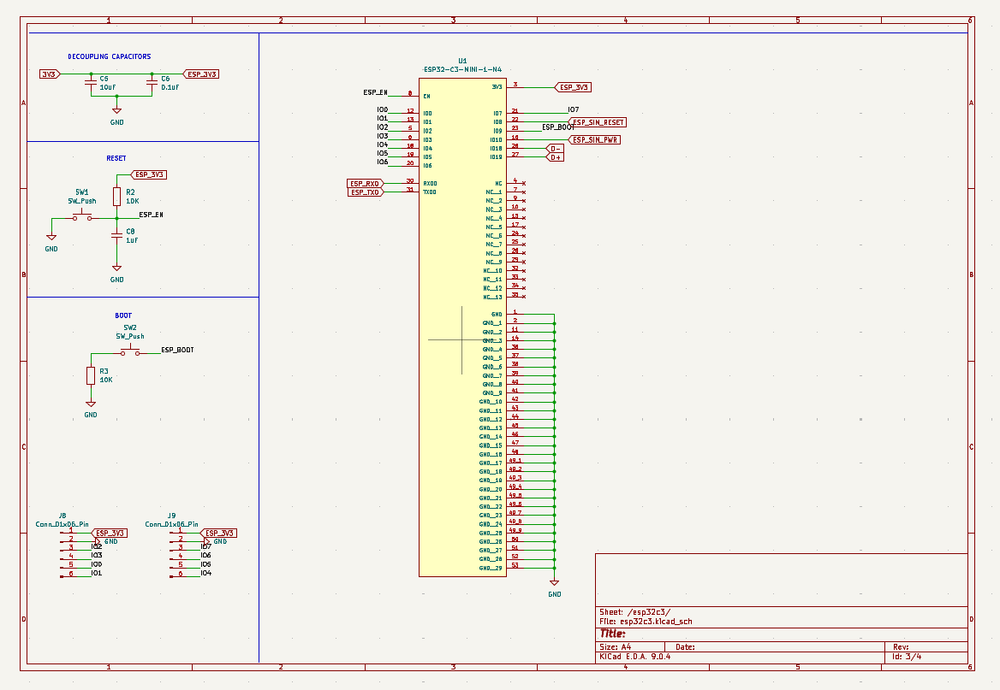
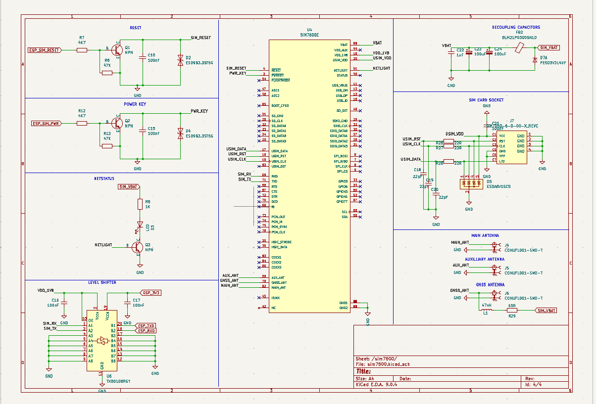
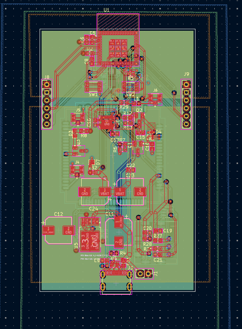

# ESP32C3_ SIM7600 PCB
 

A custom PCB for wifi, cellular and GPS applications

## Features
- ESP32-C3 MCU
- SIM7600 MCU
- USB-C power input
- Designed in KiCad 9.0

## Preview

## Schematic

## PCB Layout

## Preview

